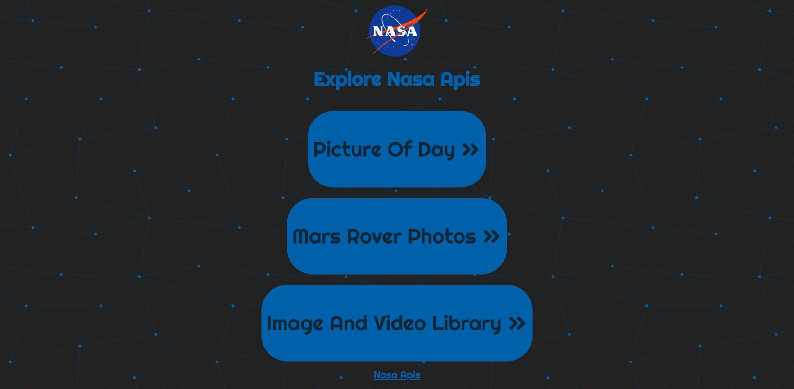
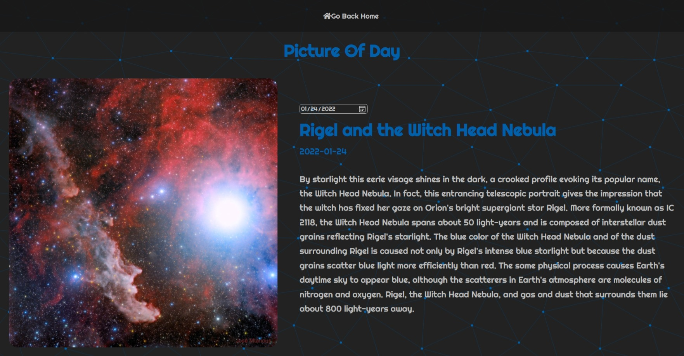
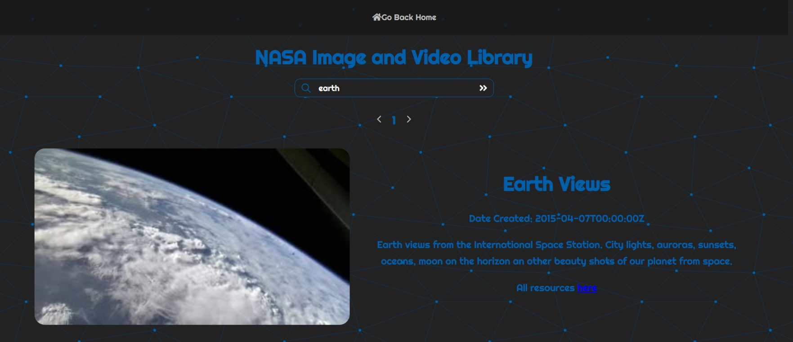
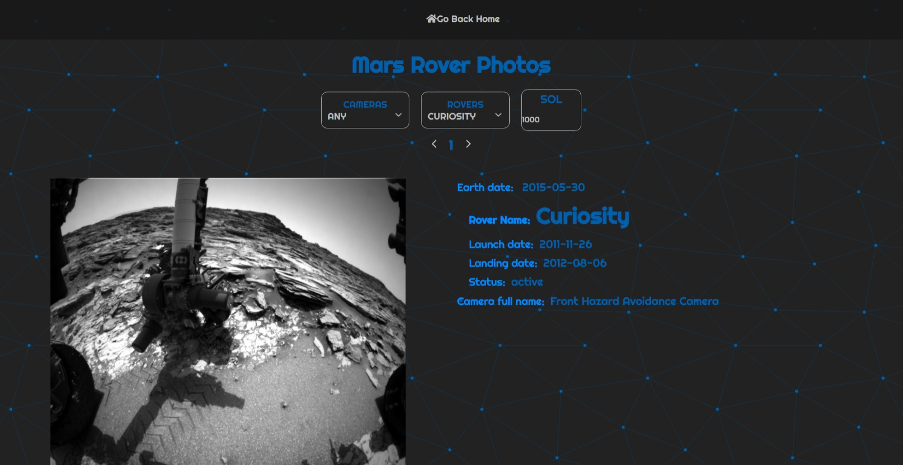

# nasa-apis
## Overview:
Explore NASA apis such as Picture Of the Day, Mars Rover Photos and NASA Image and Video Library. 🚀 

## Features:
### Picture Of The Day:
- Get NASA's space picture(or video) of the day with its description.
- Select Dates in the history to view picture of the day.
### Mars Rover Photos: 
- View images and data gathered by NASA's Curiosity, Opportunity, and Spirit rovers on Mars.
- Filter the images by cameras, rovers, sol.
- Images are separated into easily navigatable pages.
### NASA Image and Video Library:
- Search for keywords from NASAs Image And Video Library.
- Pressing Enter key for submitting the search input is supported.
- Navigate between pages.

## Tech:
- Reactjs
- React-Router
- Styled-Components
- React-Icons
- Fetch API
- Async/Await
## Screenshots:

## Contact:
- Filip Ivanovic
- Email: alkanoidev@gmail.com 

## Create React App

This project was bootstrapped with [Create React App](https://github.com/facebook/create-react-app).

## Available Scripts

In the project directory, you can run:

### `npm start`

Runs the app in the development mode.\
Open [http://localhost:3000](http://localhost:3000) to view it in your browser.

The page will reload when you make changes.\
You may also see any lint errors in the console.

### `npm test`

Launches the test runner in the interactive watch mode.\
See the section about [running tests](https://facebook.github.io/create-react-app/docs/running-tests) for more information.

### `npm run build`

Builds the app for production to the `build` folder.\
It correctly bundles React in production mode and optimizes the build for the best performance.

The build is minified and the filenames include the hashes.\
Your app is ready to be deployed!

See the section about [deployment](https://facebook.github.io/create-react-app/docs/deployment) for more information.
